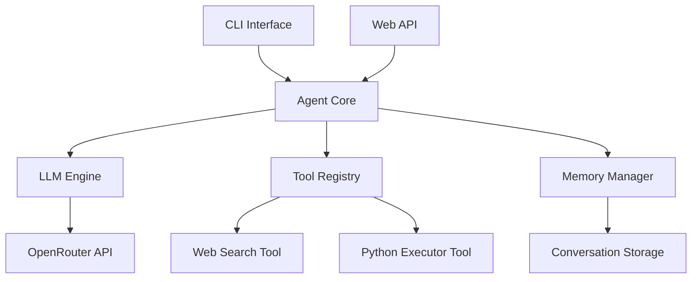

# AgentWorkShop


An advanced AI agent system that combines language models with tool execution capabilities, featuring a conversational CLI interface and web API.

## About

AgentWorkShop is a comprehensive AI agent framework designed to demonstrate the integration of large language models with practical tool execution capabilities. The project serves as both a functional AI assistant and an educational example of how to build sophisticated agent systems.

### Key Differentiators

- **Unified Interface**: Both CLI and Web API provide seamless access to the same agent capabilities
- **Extensible Tool System**: Easy to add new tools for various domains and use cases
- **Persistent Memory**: Conversations are saved and can be resumed with context
- **Production-Ready**: Built with FastAPI, rich logging, and comprehensive error handling
- **OpenRouter Integration**: Access to multiple LLM providers through a single interface

### Use Cases

- **Development**: Test and prototype AI agent workflows
- **Research**: Experiment with different prompting strategies and tool combinations
- **Education**: Learn about agent architecture and LLM integration patterns
- **Automation**: Build automated assistants for specific tasks
- **Integration**: Embed AI capabilities into existing applications

## Features

- **AI Assistant CLI**: Interactive command-line interface for AI conversations
- **Web API**: RESTful API using FastAPI for programmatic access
- **Tool System**: Extensible tool framework including web search and Python execution
- **Memory Management**: Persistent conversation memory with context tracking
- **LLM Integration**: OpenRouter API support for multiple language models
- **Stream Processing**: Real-time streaming responses for better UX
- **Structured Logging**: Rich logging with colored output and structured logs

## Architecture



The system follows a modular architecture with clear separation of concerns:

- **CLI Layer**: User interaction through command-line interface
- **Agent Layer**: Core agent logic, planning, and tool orchestration
- **LLM Layer**: Language model integration, prompt management, and structured outputs
- **Tool Layer**: Extensible tool framework for external capabilities
- **Memory Layer**: Conversation persistence and context management
- **API Layer**: Web service endpoints for programmatic access

## Installation

### Prerequisites

- Python 3.14 or higher
- pip or uv package manager

### Installation Steps

```bash
# Clone the repository
https://github.com/AmirHoseein99/AgentWorkShop.git

# Navigate to project directory
cd AgentWorkShop

# Install dependencies using pip
pip install -r requirements.txt

# Or using uv (recommended)
uv sync

# Install the package in development mode
pip install -e .
```

### Quick Start

```bash
# Start the CLI assistant
code-pilot

# Start the web API
uvicorn server:app --reload
```

## Quick Start

### Using CLI

```bash
# Launch the AI assistant
code-pilot

# Interactive session features:
/exit - Exit the assistant
/clear - Clear conversation history
```

### Using Web API

```bash
# Start the FastAPI server
uvicorn server:app --reload

# Test the API endpoints
curl "http://localhost:8000/api/llm/ask?user_input=Hello"
curl -X POST "http://localhost:8000/api/agent/call_agent?user_input=Hello"
```

### Example CLI Session

```
[cyan]AI Assistant ready — /exit to quit, /clear to reset[/cyan]

[bold red]You:[/bold red]
      What is the capital of France?

[blue]⠋ Thinking...[/blue]

[bold green]Assistant:[/bold green]
The capital of France is Paris. It's known for its art, fashion, and culture.
```

## Project Structure

```
/AgentWorkShop/
├── src/
│   ├── cli.py                   # Command-line interface
│   ├── server.py                # FastAPI web server
│   ├── agent/                   # Agent core system
│   │   ├── agent.py             # Main Agent class
│   │   ├── api.py               # Agent API endpoints
│   │   ├── state.py             # AgentState dataclass
│   │   ├── llm_runner.py        # LLM execution wrapper
│   │   ├── response_handler.py  # Response parsing and state updates
│   │   ├── tool_executer.py     # Tool validation and execution
│   │   ├── action_executer.py   # Action orchestration for tool calls and final responses
│   │   ├── parser.py            # LLM response validation and formatting
│   │   ├── planner/             # Planning subsystem
│   │   │   ├── planner.py       # Planner class
│   │   │   ├── planner_prompt.py # Planner prompt builder
│   │   │   └── models.py        # ExecutionPlan and PlanStep models
│   │   └── tools/               # Tool implementations
│   │       ├── base.py          # Base tool class
│   │       ├── python_executor.py  # Python execution tool
│   │       └── web_search.py      # Web search tool
│   ├── core/                    # Core utilities
│   │   └── config.py            # Configuration management
│   ├── llm/                     # LLM integration
│   │   ├── api.py               # LLM API endpoints
│   │   ├── chat_engine.py       # Chat engine
│   │   ├── openrouter.py        # OpenRouter integration
│   │   ├── parser.py            # OpenRouter stream parsing
│   │   ├── structure.py         # Output schemas for planner, agent, and memory
│   │   ├── utils.py             # Streaming utilities
│   │   └── prompts/             # Prompt templates
│   │       ├── agent_system_prompt.py  # Agent system prompt builder
│   │       ├── memory_prompt.py        # Memory summarizer prompt
│   │       └── planner.txt             # Planner prompt template
│   ├── memory/                  # Memory system
│   │   ├── json_memory.py       # JSON-based memory storage
│   │   └── memory_manager.py    # Memory management
│   ├── exceptions.py            # Custom exception classes
│   ├── logger.py                # Structured file logging setup
│   └── tests/                   # Test suite
│       ├── test_parser.py       # Parser tests
│       └── test_tools.py        # Tool tests
├── .github/workflows/           # CI workflows
│   └── tests.yml                # Tests, ruff check, and formatting
├── pyproject.toml               # Project configuration
├── README.md                    # This file
└── requirements.txt             # Dependencies (generated)
```

## Agent System

### Core Components

- **Agent**: Main orchestrator that coordinates planning, LLM calls, and tool execution
- **Planner**: Generates an `ExecutionPlan` with high-level steps before running the agent loop
- **AgentState**: Tracks conversation state, steps, tool results, and plan progress
- **LLMRunner**: Wraps LLM API calls for the agent
- **ResponseHandler**: Parses LLM responses and updates agent state
- **ActionExecutor**: Handles final responses and tool call outcomes
- **ToolExecutor**: Validates arguments and executes registered tools

### Agent Workflow

1. **Plan Generation**: The `Planner` produces an `ExecutionPlan` from the user's request
2. **LLM Loop**: The agent calls the LLM with the current message history
3. **Response Parsing**: `ResponseHandler` parses the structured LLM response
4. **Action Execution**: `ActionExecutor` either returns a final answer or executes a tool
5. **State Update**: Conversation history and tool results are stored in `AgentState`
6. **Memory Update**: Responses are persisted for future context

## Tool System

The tool system provides extensible capabilities for the agent to interact with external services:

### Available Tools

1. **Web Search Tool**
   - Searches the web for information
   - Returns structured results with titles, snippets, and URLs
   - Used for research and fact-checking

2. **Python Executor Tool**
   - Executes Python code safely
   - Captures output and errors
   - Used for computational tasks and data analysis

### Tool Architecture

```python
class BaseTool:
    def __init__(self, name: str, description: str, schema: dict):
        self.name = name
        self.description = description
        self.schema = schema

    def validate(self, args: dict):
        raise NotImplementedError

    async def execute(self, **kwargs) -> str:
        raise NotImplementedError
```

### Tool Registration

Tools are registered with the agent:

```python
agent = Agent()
agent.register_tool(WebSearchTool())
agent.register_tool(PythonExecutorTool())
```

## Planner

The planner generates a structured execution plan before the agent begins working:

```python
from agent.planner.planner import Planner
from agent.planner.models import ExecutionPlan

planner = Planner()
plan: ExecutionPlan = planner.produce_plan(user_input="Build a todo app")
```

### Execution Plan Structure

- **goal**: Overall objective of the user's request
- **summary**: Brief summary of the planning process
- **steps**: Ordered high-level tasks with expected outputs and dependencies

## Memory System

The memory system provides persistent storage for conversations and context:

### Key Features

- **Conversation Storage**: Persistent conversation history
- **Context Management**: Maintains conversation context across interactions
- **Memory Manager**: Centralized memory operations with automatic summarization
- **JSON Backend**: Simple and portable storage format

### Memory Operations

```python
from memory.memory_manager import (
    initialize_conversation,
    get_context,
    append_to_conversation,
)

# Initialize a new conversation
initialize_conversation(conversation_id="conv_123")

# Add user message
append_to_conversation(
    role="user",
    content="Hello, how are you?",
    conversation_id="conv_123"
)

# Get conversation context
context = get_context(conversation_id="conv_123")
```

### Memory Files

Memory is stored in the `data/conversations/` directory:

```
/data/conversations/
├── abc/
│   ├── conversation.json  # Conversation history
│   └── memory.json        # Memory context
├── conv1/
│   ├── conversation.json
│   └── memory.json
└── ...
```

### Memory Summarization

When the conversation exceeds the configured threshold, the memory manager automatically summarizes older messages into compact facts, tasks, and a high-level summary, allowing long-running sessions without losing context.

## Structured Outputs

The project uses strict JSON schemas for LLM responses:

- **Agent Output**: `final` or `tool_call` with tool name and arguments
- **Planner Output**: Goal, summary, and ordered steps with dependencies
- **Memory Summarizer Output**: Summary, facts, open tasks, and last summarized index

## Exception Handling

Custom exceptions provide clear error handling across the system:

- `ToolNotFoundError` - Raised when a requested tool is not registered
- `ToolValidationError` - Raised when tool arguments fail schema validation
- `ToolExecutionError` - Raised when a tool fails during execution
- `ParserError` - Raised when the LLM response cannot be parsed
- `LLMError` - Raised for general LLM API failures

## Configuration

Configuration is managed through environment variables:

| Variable | Description |
|----------|-------------|
| `OPENROUTER_API_KEY` | API key for OpenRouter |
| `OPENROUTER_API_BASE_URL` | Base URL for OpenRouter API |
| `OPENROUTER_MODEL` | Model identifier to use |
| `TAVILY_API_KEY` | API key for Tavily web search |
| `PROXY` | Optional HTTP/HTTPS proxy URL |

Default agent settings are defined in `src/core/config.py`:

- `AGENT_MAX_STEP`: 5
- `CONTEXT_WINDOW_SIZE`: 10
- `CONVERSATION_MEMORY_THRESHOLD`: 20

## Running Tests

The project includes a comprehensive test suite:

### Test Commands

```bash
# Run all tests
pytest

# Run specific test module
pytest tests/test_parser.py

# Run tests with verbose output
pytest -v

# Run tests with coverage
pytest --cov=src
```

### Test Categories

- **Parser Tests**: LLM response parsing and validation
- **Tool Tests**: Individual tool functionality

### CI Checks

The GitHub Actions workflow runs on every push and pull request:

- `pytest` for tests
- `ruff check .` for linting
- `ruff format --check .` for formatting

## License

This project is licensed under the MIT License. See the LICENSE file for details.

---

Made with ❤️ by the AmirHossein Imani
